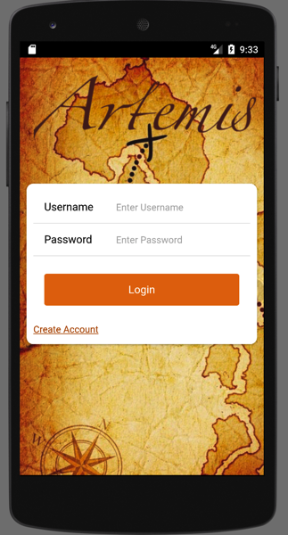
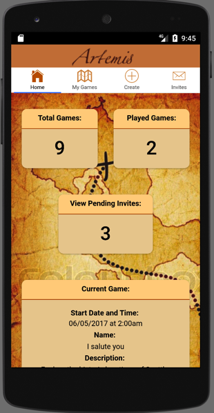
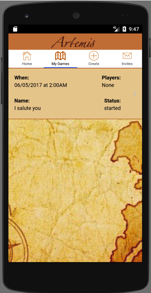
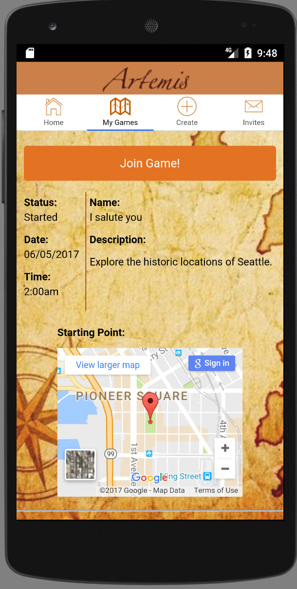
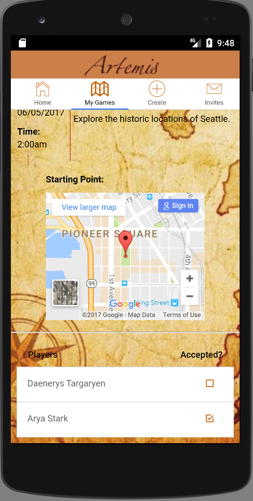
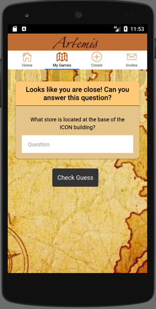
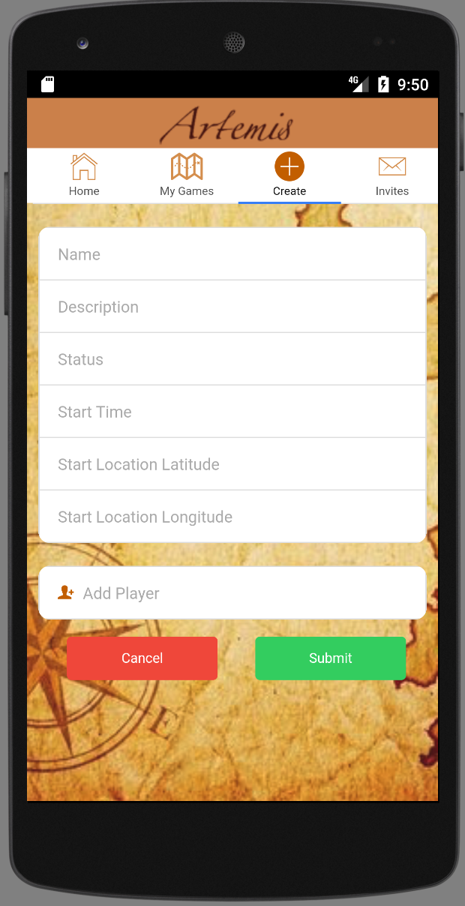

# Artemis - G48 Quarter 3 Project

## What is Artemis?

Artemis is a mobile scavenger hunt application for Android devices, developed and designed by G48 Web Development students Donny Barclay, Joshua Warren, and Summer Barclay.

As we were all new to Seattle, the idea of Artemis came to us as a way to meet new people, explore our surroundings, and get exercise in the bargain. Intuitive navigation between features was our main priority when designing the interface.

### Features

Users can quickly create a new game, with custom clues and hints, invite users to an existing game, accept invitations for upcoming games, view details on accepted games, or join an in-progress game.

  

    
Login

    

      
    

  

  

    
Dashboard

    

      
    

  

  

    
My Games

    

      
    

  

  

    
Game Details

    

      
      
    

  

  

    
Game Play

    

      
      
    

  

  

    
Create a New Game

    

      
    

  

  

    
View Invitations

    

      
    

  

## Technologies
* AngularJS
* Ionic
* Apache Cordova
* PostgreSQL
* JavaScript
* Express.js
* Node.js
* API deployed on Heroku
  * [Click here to view the API README](https://github.com/Doubleshot1122/artemis_api)

## Development Team
- Donny Barclay
  - [Click here to view Donny’s github](https://github.com/Doubleshot1122)
- Joshua Warren
  - [Click here to view Joshua’s github](https://github.com/Shiftyfive)
- Summer Barclay
  - [Click here to view Summer’s github](https://github.com/Mavyllos)
